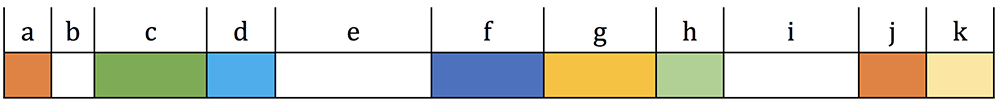
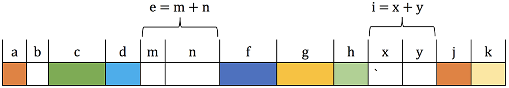
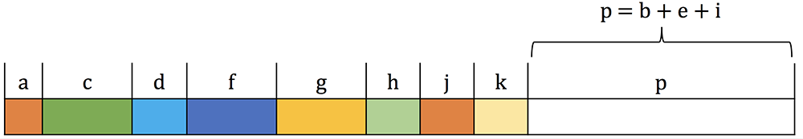

# CMPT 300 Assignment 3: Memory Management

**Total points**: 100  
**Overall percentage**: 15%  
**Due**: Mon Mar 27, 23:59:59 PT

This assignment may be completed individually or in a group (up to three people).

## Grouping

You can do the assignment as a group of up to 3 people if you'd like. If you do, make sure that
everyone joins the same team on GitHub Classroom. When you accept the invite for this assignment,
you can create a team if no one else in your team has created a team, or join an existing team.

## Note on Joining a Team on GitHub Classroom

Please make sure that you don't join a team without prior consent. **If that happens, it will be
considered cheating** as you can see the code that others have written.

## Git with Your Team

When you collaborate with others with Git, it is best to communicate with each other frequently in
order to avoid conflicts. For example, if you and your teammate edit the same part of the code and
push it to the remote GitHub repo, it will create a conflict. Cases like this require manual
merging, which is often difficult to get right. Thus, it is best to communicate with each other and
know which parts of the code others are working on.

Also, make sure you frequently pull the latest updates from your remote GitHub repo by running
`git pull`. Frequently doing this is very important.

## Overview

In this assignment you will implement a multi-threaded memory allocator that uses some memory
management techniques that are discussed in class. You solution should be based on the provided
code. `main.c` contains a main function that tests your allocator. We're providing this for your
testing purposes. You should add your own test cases for more thorough testing. We may change the
test cases or add more for actual grading.

**Note:** As usual, all code **must** be written in C and run on a Linux machine. We will grade your
code on a Linux machine. You should create a directory for this assignment, such as _~/cmpt300/a3/_
and put all files related to this assignment in it.

## Allocator Design

### Initialization

The allocator needs to know the total size of memory assumed in this project and the memory
allocation algorithm to be used. This information will be supplied by the following API:

```c
void initialize_allocator(int size, enum allocation_algorithm);
```

In the above function, `size` indicates the contiguous memory chunk size that is assumed for the
rest of the program. Any requests for allocation and deallocation requests (see
[Allocation/deallocation interfaces](#allocationdeallocation-interfaces)) will be served from this
contiguous chunk. You must allocate the memory chunk using `malloc` and have the memory chunk
pre-faulted and its content initialized to 0; you can do this using
[`memset`](https://linux.die.net/man/3/memset). The `allocation_algorithm` parameter is an enum (as
shown below) which will determine the algorithm used for allocation in the rest of the program:

```c
enum allocation_algorithm { FIRST_FIT, BEST_FIT, WORST_FIT };
```

`FIRST_FIT` satisfies the allocation request from the first available memory block (from left) that
is at least as large as the requested size. `BEST_FIT` satisfies the allocation request from the
available memory block that at least as large as the requested size and that results in the smallest
remainder fragment. `WORST_FIT` satisfies the allocation request from the available memory block
that at least as large as the requested size and that results in the largest remainder fragment.

### Allocation/deallocation interfaces

The allocation and deallocation requests will be similar to `malloc` and `free` calls in C, except
that they are called `allocate` and `deallocate` with the following signatures:

```c
void *allocate(int size);
void deallocate(void *ptr);
```

As expected, `allocate` returns a pointer to the allocated block of size `size` and `deallocate`
takes a pointer to a chunk of memory as the sole parameter and return it back to the allocator. If
allocation cannot be satisfied, `allocate` returns `NULL`. Hence, the calling program should look
like:

```c
int* p = (int*)allocate(sizeof(int));
if (p != NULL) {
  // do_some_work(p);
  deallocate(p);
}
```

### Metadata Management

You should maintain the size of allocated memory block within the block itself, as described in the
lecture "Main Memory Part 2" (slide #11). The "header" should only contain a single 8-byte word that
denotes the size of the actual allocation (i.e., 8-byte + requested allocation size). For example,
if the request asks for 16 bytes of memory, you should actually allocate 8 + 16 bytes, and use the
first 8-byte to store the size of the total allocation (24 bytes) and return a pointer to the
user-visible 16-byte.

To manage free/allocated space, you should maintain two separate singly linked lists, one for
allocated blocks, and the other for free blocks. When a block gets allocated (using `allocate`), its
metadata (i.e., a pointer to the allocation) must be inserted to the list of allocated blocks.
Similarly when a block gets freed (using `deallocate`), its metadata must be inserted to the list of
free blocks. Note that each linked list node should only contain a pointer to the allocated memory
block and a pointer to the next node in the list, because size of the allocation is already recorded
with the memory block itself (previous point). The free list must never maintain contiguous free
blocks (as shown in Figure 1), i.e., if two blocks, one of size _m_ and other of size _n_, are
consecutive in the memory chunk, they must become a combined block of size m + n (as shown in Figure
2). This combination must happen when `deallocate` is called.



_Figure 1: Each block is labeled with its size. White indicates free block while allocated blocks
are colored._



_Figure 2: Example with contiguous free blocks. This should never occur as contiguous free blocks
should be merged immediately (as shown in Figure 1)._

### Compaction

Since contiguous allocation results in fragmentation, the allocator must support a compaction API as
shown below:

```c
int compact_allocation(void** _before, void** _after);
```

Compaction will be performed by grouping the allocated memory blocks in the beginning of the memory
chunk and combining the free memory at the end of the memory chunk (as shown in Figure 3). This
process will require you to manipulate the allocated and free metadata lists. The process of
compaction must be in-place, which means that you must not declare extra memory chunk to perform
compaction. This can be done by going through the allocated list in sorted address order (relative
to the base memory address, allocated during initialization), and copy contents of allocated blocks
gradually (piece by piece) to the free space on its "left."



_Figure 3: Result of compaction on memory chunk shown in Figure 1_

As compaction relocates data, all the pointer addresses in the driver program must also be updated.
Hence, the API accepts `_before` and `_after` arrays of `void*` pointers (hence they are `void**`).
The relocation logic will insert the previous address and new address of each relocated block in
`_before` and `_after`. You can assume that `_before` and `_after` arrays supplied by the driver
program are large enough (i.e., you don't need to worry about allocation of these two arrays). The
return value is an integer which is the total number of pointers inserted in the `_before`/`_after`
array. This way, the calling program can perform pointer adjustment like this:

```c
void* before[100];
void* after[100]; // in this example, total # of pointers is less than 100
int count = compact_allocation(before, after);
for (int i = 0; i < count; ++i) {
    // Update pointers
}
```

### Statistics

Information about the current state of memory can be found by the following API:

```c
void get_statistics(struct Stats*);
int available_memory();
```

`get_statistics(struct Stats*)` should populate the detailed statistics in the `struct Stats*` given
as the argument.

`available_memory()` returns the available memory size (same as Free size in `get_statistics()`)

### Multi-threading support

Your allocator must support multi-threading, i.e., it must correct allocate, deallocate, and do
compaction even with mutliple concurrent threads.

You may follow the simple design that uses a global `pthread_mutex` to protect the entire allocator.
That is, all the previous mentioned functions (except initialization), must first acquire the mutex
before continuing to do its work, and must release the mutex before returning. You are also free to
devise your own synchronization mechanism; as long as your allocator can support multi-threading,
you will get the points in this part.

### Uninitialization

In order to avoid memory leaks after using your contiguous allocator, you need to implement a
function that will release any dynamically allocated memory in your contiguous allocator.

```c
void destroy_allocator();
```

You can assume that the `destroy_allocator()` will always be the last function call of main function
in the test cases. And similar to previous projects, valgrind will be used to detect memory leaks
and memory errors.

**Hint:** You can use your own linked list solution or the provided solution set from Assignment 0.

## Submission

**Most importantly, make sure you push your code before the deadline.**

Add, commit, and push frequently to the remote repo. E.g.,

```bash
git pull
git add *.c *.h Makefile
git commit -m "your commit message (explain your commit)"
git push
```

**Again, make sure you push your code before the deadline.**

We will build your code using your `Makefile`, and test it as a library. You may use more than one
`.c/.h` file in your solution if you like. If so, your `Makefile` must correctly build your project.
Please remember that all submissions will automatically be compared for unexplainable similarities.

## Grading Policies

Make sure you are familiar with the course policies. Especially, we do not accept late submissions,
so please submit on time by the deadline.

Your code must compile and run on Linux; **you will receive a 0 if your code does not compile.**
Sample solutions will **not** be provided for assignments. Your code should also not leak any
memory; we will check using Valgrind. Any memory leak will lead to -10 points. We will test your
code using more complex and hidden test cases, so you are encouraged to vary as many parameters as
possible to test your code.

## Grading Distribution

- [5] Correct initialization & uninitialization
- [30] Correct allocation
  - [10] FIRST_FIT algorithm
  - [10] BEST_FIT algorithm
  - [10] WORST_FIT algorithm
- [10] Correct metadata management
- [10] Correct deallocation
- [10] Correct compaction
- [5] Correct statistics
- [10] Correct multi-threading support
- [10] Correct memory access
    Will be tested using Valgrind
- [10] Good code quality
    Make sure you follow a style guide such as [LLVM Coding
    Standards](https://llvm.org/docs/CodingStandards.html), [Google C++ Style
    Guide](https://google.github.io/styleguide/cppguide.html), [Mozilla C++ Coding
    Style](https://firefox-source-docs.mozilla.org/code-quality/coding-style/coding_style_cpp.html),
    etc. If you are using VS Code, you can install C/C++ Extension Pack and choose a code formatter
    that can automatically format your code upon saving. Other IDEs have similar plug-ins as well,
    so make sure you use those.

`main.c` contains a main function that tests your allocator. We only provide it for your testing
purposes. You should write your own test cases for more thorough testing. Actual grading may differ
from what's in `main.c`.

Code that does not compile gets a 0.

Everyone in the same team receives the same grade.

## Acknowledgment

Created by Mohamed Hefeeda, modified by Brian Fraser, Keval Vora, Tianzheng Wang, and Steve Ko.
