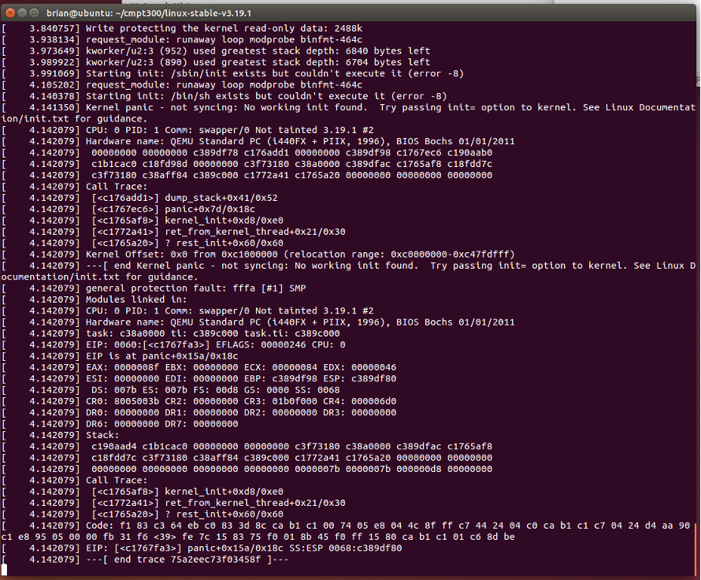

# CMPT 300 Custom Kernel Guide

This document guides you through:

* Downloading and compiling the Linux kernel's source code.
* Running a custom kernel inside a text-only virtual machine (via QEMU).
* Reconfiguring and rebuilding the kernel.
* Compiling an application to run in the QEMU VM and copying the file into it.

Note: All commands are case sensitive.

## Compiling Linux Kernel from Source

Throughout this document we assume you run a 64-bit Linux OS. You can check using command `uname
-m`: i686 means 32-bit, x86_64 means 64-bit.

You *can* use a VM to compile a Linux kernel, though it is not recommended since it's slow. It is
best to use a machine natively. (But [later when you run a kernel using
QEMU](#running-a-custom-kernel-in-qemu), you *should not* use a VM.)

* Change to the `linux-5.4.109` directory:

  ```bash
  $ cd linux-5.4.109
  ```

* If you’re using your own machine, install packages necessary for building the kernel. On Ubuntu
  Server 22.04.2 LTS, the following packages are necessary. Depending on the exact distro/version
  of Linux you're using, you need to find and install equivalent packages and more. If you do not
  have appropriate packages, you will get compile errors later on.

  ```bash
  $ sudo apt install git make gcc flex bison libssl-dev
  ```

* Setup the default `config` file for building the kernel. This file has all the build options, the
  defaults will be sufficient for the moment:

  ```bash
  $ make defconfig
  ```

* Build the Linux kernel:

  ```bash
  $ make -jX
  ```

  * `X` is the number of cores your system has (discover with command `nproc`). Using the wrong
    number of cores (i.e., more cores than you actually have) will overload the system and may cause
    the build to fail.
  * Running this command may take a while, so be patient!

* Once the build process finishes, you can view the kernel file that you just built.

  ```bash
  $ ls -l arch/x86_64/boot/bzImage
  lrwxrwxrwx 1 tzwang tzwang 10 Mar 30 13:31 arch/x86_64/boot/bzImage -> ../../x86/boot/bzImage
  ```

Congratulations! You have built your own kernel now! See the following troubleshooting tips if you
run into problems.

* Kernel build failed?
  * If there is a problem building, look at the build output to see if there are errors. Try
    searching the web for hints on resolving your error. Sometimes it is because you don't have
    the packages needed.
  * Ensure that you are not out of space on the current drive (read the “Avail” column):

    ```bash
    $ df -H .
    Filesystem      Size  Used Avail Use% Mounted on
    /dev/sda1        57G   47G  7.7G  86% /
    ```
  
  * Run a `make clean`, followed by a `make -j1`. Specifying more cores than your system (VM) has
    can cause build problems. List the number of cores on your system with:

    ```bash
    $ nproc
    ```

  * If the `x86_64/` directory did not show up when building on a 64-bit OS, it could indicate a
    build problem. However, if the x86 directory is there, you may be able to use it instead.
  * If running in a VM and sharing the directory with the guest OS, make sure that the file system
    you are working inside of supports case-sensitive file names. For example, building in a
    directory shared from Mac OS will cause files whose name differ only in letter case to overwrite
    each other and cause the build to fail.
* VM Too Slow? You are strongly recommended to run things natively instead of doing this in a VM.
  But if you have to, try the following:
  * Give the VM more memory (RAM) to work with.
  * Give the VM more CPU cores to work with.
  * Enable 3D graphics acceleration to the VM.
  * (All of these changes must be done when the VM is powered down).

## Running a Custom Kernel in QEMU

* You *should not* use a VM to run QEMU. Use a machine natively (your own or CSIL).
* If you are working on your own machine, you need to install QEMU. For example on Ubuntu:

  ```bash
  $ sudo apt-get update
  $ sudo apt-get install qemu-system-x86
  ```

  * These are the commands for Ubuntu. If using a different distribution then consult the
    documentation for your system.
  * If you are working in the CSIL labs (under Linux) then QEMU is already installed. NOTE: If you
    are in the CSIL lab, never run the "sudo" command because it will be logged that you are trying
    to run commands that you do not have permission to run and will automatically notify our system
    administrators. You may, however, run sudo commands inside your VM (i.e., inside QEMU), but not
    on the host machine.

* Download the following two VM image files (you need to log in with your SFU OneDrive):

  [ubuntu-20.04-server-cloudimg-amd64.img](https://1sfu-my.sharepoint.com/:u:/g/personal/steveyko_sfu_ca/EZPx17aLrr5Gj3PG2TotLn0BGwS1ttT3M7i7SUGfJZYFaw?e=qj7lva)

  [ubuntu-20.04-server-cloudimg-amd64.qcow2](https://1sfu-my.sharepoint.com/:u:/g/personal/steveyko_sfu_ca/EW_Yz8NTQd9OoqK_zrpM02MBnPGe13enRmHTqa3ZFBkR9g?e=hWE7g8)

  * Save both in the repo root directory (the directory one level above `linux-5.4.109/`)

* Make sure you are currently under the repo root directory.

* Run QEMU using the following command (but read first the bullet points below before running it):

  ```bash
  $ qemu-system-x86_64 -nographic -m 3G \
  -drive file=./ubuntu-20.04-server-cloudimg-amd64.qcow2,format=qcow2 \
  -enable-kvm \
  -smp 4 \
  -nic user,hostfwd=tcp::9347-:22
  ```

  * This command runs the default kernel that comes with the VM image.
  * Notice that we’re passing `-nographic` as an argument, which uses the console interface. You may
    press `Ctrl + A + X` to terminate the VM.
  * It may take a while until you see the first detailed, Ubuntu boot progress, so be patient!
  * If you don’t pass `-nographic`, you can use the GUI, but you need to enable X11Forward in SSH
    configuration for this to work. You can just try and see if it works. If it works, you will see
    a window popped up showing the booting progress. You can directly close the window to terminate
    the VM (as if you cut the power of the machine).
  * If using a CSIL server, you probably need to remove the `-enable-kvm` option for this to work.
  * The default `-m 3G` parameter allocates 3GB main memory for the VM. If this is too big (or too
    small) for your machine, adjust it accordingly.

* If everything works, you can terminate the QEMU instance, and restart the VM with your newly
  compiled kernel:

  ```bash
  $ qemu-system-x86_64 -nographic -m 3G \
  -drive file=./ubuntu-20.04-server-cloudimg-amd64.qcow2,format=qcow2 \
  -enable-kvm \
  -smp 4 \
  -nic user,hostfwd=tcp::9347-:22 \
  -kernel ./linux-5.4.109/arch/x86_64/boot/bzImage \
  -append "root=/dev/sda1 console=ttyS0,115200n8 console=tty0"
  ```

* When the QEMU virtual machine has finished booting, you should see the following login prompt (or
  something similar to it):

  ```bash
  Ubuntu 20.04.2 LTS ubuntu ttyS0
  test3 login:
  ```

* Log into the machine – a default root user is available. Note that this is not a good practice in
  real production environments, but again for our purpose of practicing kernel development, it is
  tolerable.

  ```bash
  Name: ubuntu
  Password: linux
  ```

* Congratulations! You are now running a Linux kernel that you compiled! Changes you make to the
  file system inside QEMU will be saved for the next time you boot the system.
* When you are done using the QEMU virtual machine, you should tell Linux running in it to power
  down:

  ```bash
  $ sudo poweroff
  ```

* If QEMU is unable to shut down gracefully, you may need to kill it from your host OS:
  * You can kill all QEMU systems with:

    ```bash
    $ killall qemu-system-x86_64
    ```

  * Or, you can find it in the list of processes you are running, and signal it directly:

    ```bash
    $ ps -a
      PID TTY       TIME CMD
     9535 pts/18    00:00:06 gedit
    11357 pts/18    00:00:00 alsamixer
    61981 pts/26    00:01:51 qemu-system-x86
    62029 pts/18    00:00:00 ps
    $ kill 61981
    ```

  * You should only kill the QEMU process (or close its window) when you are unable to execute the
    `poweroff` command. Failing to do so may corrupt the file system.

* Troubleshooting
  * If you get a kernel panic, you may need to scroll back a bit to the start of the panic to see
    what went wrong. You want to read the couple lines above the "Kernel panic" lines. Figure 1
    shows a sample kernel panic (this one for trying to run the 64-bit root file system with a 32
    bit kernel).

    

    _Figure 1: Sample terminal window showing a kernel panic on boot._

  * If you get a kernel panic at boot, it could be a problem access the root file system. A few
    things to check:
    * Make sure you have the correct root file system downloaded for your OS version that it is in
      the expected location.
    * The following message (seen when booting QEMU) likely means you have the wrong root file
      system version for the kernel you compiled.

      ```bash
      Starting init: /bin/sh exists but couldn't execute it (error -8) Kernel panic - not syncing:
      No working init found.  Try passing init= option to kernel. See Linux Documentation/init.txt
      for guidance.
      ```

    * The following message likely means that you have a corrupt/invalid root file system image
      (.qcow2 file). Re-download the root file system image.

      ```bash
      VFS: Cannot open root device "sda1" or unknown-block(8,1): error -6
      ```

    * If you get messages about file system corruption and fsck, it likely means the root file
      system image has corrupted and you need to re-download a new one. The corruption is likely due
      to the VM being killed or closed instead of using the `poweroff` command.

## Modifying and Rebuilding Kernel

* From within the `linux-5.4.109/` directory, launch the Linux kernel build configuration menu:

  ```bash
  $ make menuconfig
  ```

* Change the kernel's "Local version." This string is appended to the kernel's version number:
  * Under `General setup --->`
  * Under `Local version - append to kernel release`
  * Type in `-id`, where id is your SFU Computing ID.
  * Save and exit.

* Rebuild the kernel:

  ```bash
  $ make
  ```

  * This should build much faster this time because it is only rebuilding the parts of the kernel
    which change, as opposed to rebuilding the entire kernel.
  * If you want to trigger a full kernel rebuild, first run the following before running make:

    ```bash
    $ make clean
    ```

* Use QEMU, as before, to boot your custom kernel. Since you have now rebuilt the kernel, it will
  now load your new kernel.
* Once logged into the QEMU virtual machine, check that the kernel version has changed:

  ```bash
  $ uname -a
  ```

  Example output:

  ```bash
  Linux ubuntu 5.4.0-1028-kvm #29-Ubuntu SMP Thu Nov 26 06:52:24 UTC 2020 x86_64 x86_64 x86_64 GNU/Linux
  ```

* Alternatively, you can check the kernel version inside your QEMU VM using:

  ```bash
  $ cat /proc/version
  ```

## Building & Deploying an Linux Application to QEMU

You can use the `scp` command to copy a file from your host machine into the QEMU virtual machine.

* For simplicity, programs that you want to copy into the QEMU VM can be compiled with static
  linking so that all necessary libraries are include in your executable. This can solve issues
  related to library versions.
  * Use the `-static` option for GCC to have it link a static binary.

    ```bash
    $ gcc helloWorld.c -std=c99 -static -o helloWorld
    ```

  * If you are using a `Makefile`, you may want to add `-static` to the `CFLAGS`.

  The links between the host and VM, between the VM and the internet should have already been setup
  in the provided VM image. It should work out of the box as long as you use the aforementioned qemu
  command to launch the VM, which is also provided below:

    ```bash
    $ qemu-system-x86_64 -m 3G \
    -drive file=./ubuntu-20.04-server-cloudimg-amd64.qcow2,format=qcow2 \
    -enable-kvm \
    -smp 4 \
    -nic user,hostfwd=tcp::9347-:22
    ```

  * Note the last option "-nic ..." which explicitly tell QEMU to enable networking (usually done by
    default) and redirects TCP traffic on the host's port 9347 (otherwise unused) to the guest's
    port 22 (SSH).
  * You can use SSH and SCP via port 9347 on the host to connect to the VM. You can use SSH to
    create additional terminals connecting to your QEMU virtual machine. You might want to do this
    if you want to run multiple different test programs at once. For example:

    ```bash
    $ ssh ubuntu@localhost -p9347
    ```

* Copy your file (helloWorld, for example) to the QEMU virtual machine via SCP using the following
  command executed in the host OS:

  ```bash
  $ scp -P 9347 helloWorld ubuntu@localhost:
  ```

  * It will ask you for the password on the VM; this will be `linux`.
  * This will copy the file `helloWorld` from your current directory on the host OS into the
    `/home/ubuntu/` directory of the guest QEMU OS.
  * Your QEMU VM must have finished booting in order for SCP to work.
  * You can copy multiple files (for example helloWorld, myApp, fooFile2) with:

    ```bash
    $ scp -P 9347 helloWorld myApp fooFile2 ubuntu@localhost:
    ```

* Run your application in the QEMU VM:

  ```bash
  $ cd
  $ ./helloWorld
  ```

  * These commands are run inside the QEMU OS, not the host.

* Troubleshooting
  * When trying to run your application in QEMU, if you get the following message it means your
    application is likely not statically linked. Add the `-static` GCC option.

    ```bash
    ./myApp: /lib/libc.so.6: version 'GLIBC_2.17' not found (required by ./myApp)
    ```

  * If you get the message `could not set up host forwarding rule 'tcp::9347:22'` when launching
    QEMU, try using a different host port (such as 8383) instead of 9347.
  * If you get the following message, it means QEMU is either not running, or has not correctly been
    started with the `-redir` argument.

    ```bash
    ssh: connect to host localhost port 9347: Connection refused
    lost connection
    ```

  * If your system seems to hang when you run `scp`, or you get the error below, it likely means
    that the OS running in QEMU may not have finished booting yet. Try waiting until the OS
    successfully boots and you can log in. You may also need to verify SSH is running in the guest
    OS (beyond the scope of this guide).

    ```bash
    ssh_exchange_identification: read: Connection reset by peer
    lost connection
    ```

## Acknowledgements

Created by Brian Fraser, Mohamed Hefeeda, and Tianzheng Wang. Modified by Steve Ko.
